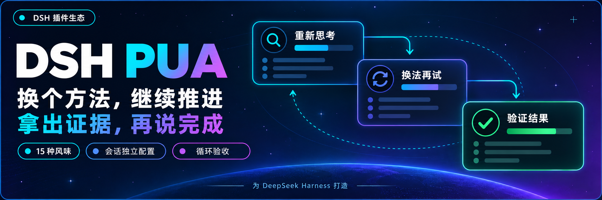

<p align="center">
  
</p>

<div align="center">

# DSH PUA

**让 Agent 少一点敷衍，多一点尝试和验证**

[English](README.md) · [它解决什么问题](#它解决什么问题) · [功能概览](#功能概览) · [安装](#安装) · [使用](#使用) · [配置](#配置) · [常用命令](#常用命令) · [本版改动](#本版改动) · [更新日志](CHANGELOG.md)

[](https://www.npmjs.com/package/@panando/dsh-pua)
[](https://www.npmjs.com/package/@panando/dsh-pua)
[](LICENSE)
[](https://nodejs.org/)

</div>

> 把 [原版 PUA](https://github.com/tanweai/pua) 带到 DeepSeek Harness。社区维护，非 DeepSeek AI 或 PUA 官方产品。

---

## 它解决什么问题

Agent 交付质量差，通常不是不会做，而是**没有被迫自证**：

| 常见行为 | PUA 的干预方式 |
| --- | --- |
| 同一个方法反复微调参数，越试越偏 | 达到失败阈值后强制切换**本质不同**的方案，原地打转直接升压 |
| 卡住就建议「建议用户手动处理」 | 判定为放弃/推锅，触发 Owner 意识检查并升压 |
| 声称「已完成」但没跑过验证命令 | 空口完成会被识别，强制贴出运行证据才计入验收 |
| 遇到报错只读一眼就下结论 | 要求查上下文、搜索同类问题、列出假设并验证 |
| 修完一个 bug 就收工 | 冰山法则：同模块同类问题、上下游影响一并处理 |

核心机制是**压力随失败次数升级、随真实验收通过降压**。压力不是目的，拿到证据才是。

## 功能概览

- **失败后换方法**：失败计数驱动 L1→L4 压力升级，每级对应强制的不同动作（换方案 / 搜索+读源码 / 七项检查清单 / 拼命模式）。
- **完成前要证据**：「已完成」必须配运行输出才算交付；可配置独立验收命令，不只看模型自述。
- **Loop 持续推进**：可启动 Loop 让 Agent 按验收结果继续修正，直到通过、达到轮次上限或手动取消。
- **旁白与风味**：15 种大厂风味（阿里 / 字节 / 华为 / 腾讯 / 百度 / 美团 / Jobs / Musk …），共 10 种角色模式（P8 标准、P7、P9、P10、Pro、Yes 鼓励、Mama 关怀、Shot、中/英文协议）。旁白开头标注当前风味，语气与关键词随风味切换。
- **防作弊门**（默认关闭）：拦截读取隐藏基准答案（含联网搜索），变更测试、评分或 CI 资产时向模型注入提醒，把行动权与自评权、评分权分开。
- **面板分区**：配置面板按「基础 / 风味与角色 / 提醒与验收」分区，字段分组清晰，「提醒与验收」默认收起。
- **全局默认 + 会话覆盖**：插件页保存全局默认，聊天面板单独调整当前会话，可逐项或一次性恢复继承。

实际效果取决于所用模型和任务，插件不保证每次都能解决问题。

## 安装

需要 Node.js 22.19 或更新版本，以及 DSH `0.1.2-rc.1`、`0.1.5-rc.1`、`0.1.5-rc.2`、`0.1.5-rc.3`、`0.1.7-rc.1`、`0.1.7-rc.2`、`0.2.0-rc.1` 或 `0.2.0-rc.2`。使用 DSH 已有的模型配置，无需额外密钥。

以下示例使用 `web` profile，请替换为实际使用的 profile。

### 让 Agent 帮你安装

把下面这段话发给能够操作本机终端的 Agent：

```text
请将 @panando/dsh-pua 安装到本机 web profile，执行 dsh plugin --profile web add @panando/dsh-pua@latest --registry=https://registry.npmjs.org/。完成后检查插件是否加载，并告诉我如何打开 PUA 配置。
```

### 手动安装

```powershell
[Console]::OutputEncoding = [System.Text.Encoding]::UTF8
$OutputEncoding = [System.Text.Encoding]::UTF8
dsh plugin --profile web add @panando/dsh-pua@latest --registry=https://registry.npmjs.org/
```

等待当前任务结束后，**重新加载 DSH 或重启 Web 服务**；仅刷新浏览器不够。输入 `/pua help` 可检查插件是否可用。

## 使用

1. 打开侧边栏「插件」，进入 `@panando/dsh-pua`，在包页或 `panando-pua` 行打开配置。
2. 开启 PUA，选择喜欢的风味和角色，保存设置。
3. 回到聊天，像平时一样提交任务。

聊天输入栏右侧常显 **PUA** 入口，点击展开下拉菜单：

- **打开 / 关闭**：直接切换当前会话的 PUA 开关，无需进面板
- **选项**：打开配置面板，调整风味、角色、提醒与 Loop

当前会话关闭时，PUA 文字显示为淡色加横线，一眼可辨。入口**恒常显示**——这是本版与上游的关键差异，详见[本版改动](#本版改动)。

## 配置

**全局默认只在插件配置页修改。聊天面板和命令只影响当前会话。**

不修改就使用全局默认；修改某一项只覆盖这一项，面板顶部可一次「恢复全部继承」。

配置面板分为三组：

| 分区 | 可以调整什么 | 说明 |
| --- | --- | --- |
| **基础** | PUA 开关、界面语言、对子代理启用 | 界面语言 `自动` 跟随宿主，或固定中文 / English；子代理默认关闭，开启后继承父会话生效配置 |
| **风味与角色** | 风味、角色模式 | 风味可选「自动」（按任务特征路由）或锁定某一种；角色模式含 P7 / P9 / P10 / Pro 等 |
| **提醒与验收** | 纠偏提醒、防作弊门、反馈提醒、Loop 默认值 | 默认收起。含终端核验、失败升级、质量纠偏提示；防作弊门默认关闭；Loop 可设验收命令、超时与轮次上限（0 为不限） |

子代理是否使用 PUA 还受父会话开关控制。命令不再修改全局设置。

### 让任务按验收结果继续

在聊天 PUA 面板的「启动或取消 Loop」中填写任务、验收命令和轮次上限，再点击启动。例如，让 Agent 修复测试，用 `npm test` 检查结果，最多执行 10 轮。

也可以直接输入：

```text
/pua loop "修复当前测试失败并补齐回归" --verify "npm test" --max-iterations 10
```

需要停止时输入 `/pua-cancel-loop` 或 `/pua cancel-loop`。关闭当前会话 PUA 也会取消 Loop，但不会撤回已经执行的操作。

建议设置验收命令和轮次上限：未设置验收命令时，只依据模型报告判断完成。

## 常用命令

日常开关、风味和角色都可以在界面操作，无需记住命令。

| 目标 | 命令示例 |
| --- | --- |
| 开启或关闭当前会话 PUA | `/pua on`、`/pua off` |
| 指定风味 | `/pua flavor huawei` |
| 让 Agent 换个方法 | `/pua again` |
| 检查是否真的完成 | `/pua done-check` |
| 检查交付证据 | `/pua evidence` |
| 只读审查当前改动 | `/pua review` |
| 恢复当前会话的全局默认 | `/pua reset` |
| 取消验收循环 | `/pua-cancel-loop`、`/pua cancel-loop` |
| 查看状态或完整用法 | `/pua status`、`/pua help` |

## 本版改动

本仓库基于 [`@michengai/dsh-pua`](https://github.com/MichengAI/dsh-pua) v0.3.22 修改而来，以 `@panando/dsh-pua` 包名发布在 npm 上，与上游是两个独立包（非官方版本）。保留原 LICENSE / NOTICE。

### 解除上游的「全局总闸」

上游把全局开关 `alwaysOn` 当作总闸：全局关闭时，聊天栏入口**不渲染**、单会话无法开启、`/pua on` 被拒绝。「入口常显」与「功能默认关闭」因此无法共存。

本版解除该限制：**入口恒常显示，功能默认仍为关闭**，需要时在输入栏菜单点「打开」即可开启当前会话。配套把入口改成下拉菜单（打开 / 关闭 / 选项），「打开」「关闭」直接生效，「选项」才进面板。

### 旁白标记风格统一（v0.1.3）

原版标记混用方括号与图标，可读性差。统一为 **emoji 前置 + 『文字』**，emoji 沿用各标记原本自带的那个，风味标注去掉「味」字：

| 原版 | 现在 |
| --- | --- |
| `[🟡 字节味]` | `🟡『字节』` |
| `[PUA生效 🔥]` | `🔥『PUA生效』` |
| `[PUA 突破 ✨]` | `✨『PUA 突破』` |
| `[方法论切换 🔄]` | `🔄『方法论切换』` |
| `[自动选择：⚫ 百度味 \| 因为：… \| 改用：🟡 字节味]` | `🔄『自动选择：百度』因为：… \| 改用：🟡『字节』` |

覆盖核心协议、各角色模式与方法论引用共 18 个原版素材文件。英文协议（`pua-en`）、markdown 链接与机器可读 ID 不变。

### 界面文案精简（v0.1.3）

语言「自动（跟随宿主）」→「自动」，风味「自动选味」→「自动」，下拉项更紧凑。

### 配置面板分区（v0.1.3）

扁平字段列表改为「基础 / 风味与角色 / 提醒与验收」三分区，「提醒与验收」收进折叠区默认收起。字段集合与配置契约不变，仅改呈现顺序。

> 完整改动清单与踩坑记录见 [CUSTOM-CHANGES.md](./CUSTOM-CHANGES.md)。

## 卸载

```powershell
[Console]::OutputEncoding = [System.Text.Encoding]::UTF8
$OutputEncoding = [System.Text.Encoding]::UTF8
dsh plugin --profile web remove @panando/dsh-pua
```

重新加载 DSH 后生效，业务文件和会话记录会保留。

## 来源与许可

基于 [tanweai/pua](https://github.com/tanweai/pua) 3.5.1 适配。

本项目原创代码采用 [Apache License 2.0](LICENSE)。随包提供的 PUA 素材保留上游声明的 MIT 许可及署名，详见 [NOTICE](NOTICE)。
